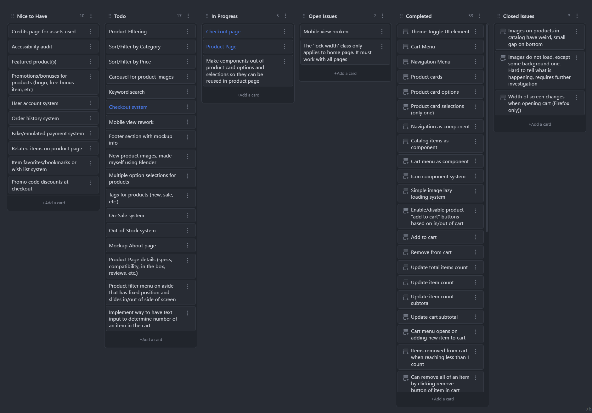

Since August 15th, I have been working on an ecommerce site project. This site is only the frontend, however I am creating a lot of mockup behavior with JavaScript to simulate it being in a "live" environment. This is by far my most ambitious project yet, and I have a lot of features planned for it, and my goal is to do it all with just vanilla JavaScript, CSS, and HTML. No libraries, frameworks, or preprocessors. Just the default browser and language supported features and APIs.

It has been difficult to make a lot of progress on it as I still have a lot of work for my classes to get done too, on top of my job, but I feel as though I am making good progress in general. I have learned a lot so far, particularly in Web Components and modules.

## Learning Modules

I remember when I first tried using modules, I just couldn't figure them out. I followed guides and tutorials on how to get them to work, but none of them ever did. I simply thought it was because it lacked browser support, or some other technical issue I had no control over.

The reality of the issue, however, was that I just wasn't doing them right. It seems so basic now, but it was really great to finally get them working. I realize now the two mistakes I was making the first time:

1. I only need to load the main script I will be using in the HTML.

Before, I was adding script tags in my html, and adding all of them at once. I think that this can work fine, but it was not necessary, as I only needed to load them in if they were actually going to be doing something on the page. If they simply had functions that I wanted to use with other scripts, I did not need to include them in my HTML. I also did not understand how the "module" attribute worked, as I was putting it on everything _except_ my main script. When using modules, you have to put the `module` attribute on any script you want to import any modules into.

2. I Was Typing the Filepath Wrong

Yup, this one is pretty dumb. The last one wasn't great either, because if I had paid better attention to guides and tutorials I would have figured it out. In fact, me getting them to work again recently involved me watching the same guide I looked at the first time I came across the concept. As for the filepath though, I always forgot to include the `.js` extension at the end of the filename. I thought, at the time, I did not have to because my editor would auto fill the path, and it did not include the extension by default. It still does not include the extension, but I just include it manually now and it all works great.

## Learning web Components

I had also learned about web components, which I had looked at before, too, and couldn't figure out. I was able to make components for a lot of things that I reuse a lot. For example, I was looking for a way to include my navigation into every page without having to copy + paste the whole thing. This was a pain because if I ever changed the layout or CSS, it may look different on another page and I would have to either paste it in again, or do some research as to what CSS was conflicting.

There were some solutions online that I found, but they either weren't performant, or were deprecated, or did not interact with the page how I expected. Web components, however, solved all of these issues I had. It made it so I had just one place to edit my navigation bar and it would update on all pages that simply had the `nav-bar` element in them. Styling was made easier too, as web components have all their styling scoped locally to themselves, and no other CSS affects them.

Web components have been very helpful to my project, but they were also a huge time sink to learn too. I have a lot of interaction on my page, specifically as I have product cards as components, my cart menu as a component, cart items as a component within the cart component, and I have to have everything interact with each other. This was pretty simple to do when I just had everything in my one long script, but then it was hard to navigate my script because it was getting _too_ long.

## My Icon System

After playing around with components and doing more research on them, I eventually got them working how I want them. I was even able to create an icon system using these, were you simply put in the tag and define its name attribute. It will then just render the icon based on the name. This is easy to style, too, as you just have to target the SVG in the CSS and you can customize nearly every aspect of it.

I made this icon system by just having all my icons in one SVG file, and giving them unique ID names. I actually don't now how good this is in practice, but it works pretty well for me right now at least. I remember one issue I had was that all the SVGs that I used came with predefined colors and stroke width. I had to remove these to change them in the CSS. The issue with this, though, is that now the icons by default have wonky or no stroke width, and the colors by default are just black. This was easy to fix, though, as I have a CSS file that is by default on every page, and in that file I have a class for SVGs where I set their default stroke and color. I don't come across many conflicts with this as most of my icons are children of other elements, so the specificity makes it simple to change them when I need to.

## Project Goals

I have a lot of goals for this project, and they are probably more ambitious that what the project is really worth. I have a board that shows a lot of what I have done and what I want to do:

By this chart, I have completed 33 features/objectives, and I still have 37 left to go before I would say I "fully" finish this project. This doesn't even count for any issues I come across yet, either. This board has been helpful, though, as it helps me keep focused on what I need to get done first. I found that throughout the project I would tend to sway to parts of it that didn't really add too much to my end goal. The board is also nice because if I have any cool ideas, I can throw them on there to remember for later when I have to implement them.

At this time I am focused on creating the individual product pages. I am making good progress so far, but I still want to add a few things that may require me reworking how products work again.

I'm not sure if this project is worth pursuing to full completion, however. I am really interested in learning a framework, particularly SvelteKit. Learning a framework would make creating a site or app like this really easy I think, compared to what I'm doing now. Using just the normal tools has been a great learning experience, though, and I'm afraid I will miss out on more important learning opportunities if I drop the project now.

The one feature I need to implement to consider this "done", or my minimal viable product, is my checkout system. I simply need to provide a UI that shows the cart items the user wants to buy, the subtotal, tax, shipping info, and then have it lead to another page which is a form asking for shipping and payment information from the user. After the user submits this info, it should display one more page that shows the order has been completed and displays the info given by the user.

This should be relatively simple. One of the hardest parts of this project has been styling things to look good. It's easy enough to just throw a form together, but it can be harder if you want it to look really nice.

## Future Projects?

After I am done with this project, I will be learning either React or SvelteKit. I really want to learn SvelteKit, but learning React will likely give me more job opportunities. I already know some React too from a class I took, however I didn't feel like I had a good chance to really understand it, which is part of why I went back to my ecommerce project too.

For specific projects, I wanted to redo my personal website in a framework/library. I may do this in SvelteKit, and do another project in React. I have a list of projects I want to complete:

1. Portfolio Project (this may be done last)
   I want a nice UI that shows all my projects.

2. Todo App
   Just a basic Todo App, but with reminders and notifications. This may be a good chance to learn something like Capacitor to make mobile apps.

3. Calendar/Task App
   Similar to the Todo app, but I want to work with dates and calendars and all that good stuff. This would be a good chance to try and use Tauri as well to make it a desktop app.

4. Note Taking App
   I have a lot of ambitions for a note taking app that actually has a lot of features, but for this project specifically I want to keep it simple. I want to try and implement a WYSIWYG editor, but that formats everything in Markdown. I also want to learn how to use the local filesystem, so that any folders/files created in the app show up on the local filesystem too, and any files/folders created by the system show up in the app.

5. Health Tracker/Mood Tracker/Habit Tracker
   I haven't really decided the scope for this yet, but I wanted to create an app where you can keep track of a daily goal or habit. This would implement concepts from both the Calendar, Todo, and Note taking app I think.

Along with these projects, I also have a lot of ideas for non-web development projects too. In particular, I want to become proficient at 3D modeling and creating product mockups. My ecommerce project is a good chance to shine here, so when I'm doing doing the coding part of the project, I was going to jump in and make my own mockup images for it too.

I also have an interest in video game development, and I was going to learn the Godot engine and make a game in it after my courses end this December. I want to utilize skills from Blender for this too, and make my own assets and animations.

I think I have spoken about a lot of these projects before, so I think I will end it here. This project has been a decently large focus of mine for a while now, and I wanted to talk about it these past few weeks. I hope I can complete it soon, because I am really itching to start a new project!

> Photo by [Negative Space](https://www.pexels.com/photo/iphone-notebook-pen-working-34088/)
