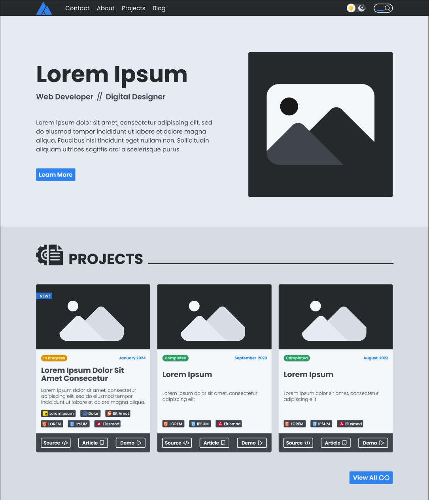

The first two weeks of November have passed, and I feel it's time to make another review.

There are a few things I want to cover for this review:

1. What I have been doing these past two weeks
2. What I plan on doing in the future
3. Some things I have learned

Pretty standard stuff, so let's dive in.

## What Have I Been Doing?

This is a bit of a hectic period for me right now, as not only am I anxious about the future, but I have a lot of fears about what is presently occurring too. I'm not even talking about world events going on either, just my personal problems.

### Classwork

Amongst these issues, my classwork is on the forefront of my mind. My final day will be on December 8th, which means I have about 4 weeks (or one month) left of my courses, and I will be out forever! This is both exciting and scary, as I have had issues keeping up around the mid-point in the past. For most of my time I have been capable of surpassing these issues, but thinking about all the work left ahead is still keeping me on my toes. The second half is always the hardest, as that is when the more advanced topics start kicking in and the instructors are less forgiving on deadlines and assignments.

### LinkedIn Profile

Another issue I have anxiety with is finding a job after graduation, which is coming up very soon. This has been both anxiety-inducing and frustrating, as I feel as though my best course of action is to focus on projects to learn more web development skills that make me more employable. The issue I am having is that I don't have time to focus on these projects, as I have to make time for all my classwork. This is frustrating because most of my classwork has very little relation to web development, at least directly.

One of my priorities this past week due to this anxiety has been refreshing my LinkedIn profile. I noticed that I have a bit too much graphic design related information on my profile, despite that not being my desired career. This is likely because I have been working as a graphic designer at my college's student engagement department for roughly two years now. While I do love the job, I have come to the realization that I love digital design and development more. This has been a great opportunity to learn software and design skills, though.

Graphic design won't get me the developer job that I want, though, so I went through and added more relevant skills, projects, college courses, and earned some badges for skills. I really I have no idea how much this improves my odds of getting hired, but anything helps I'm sure.

Another thing I want to do is redo my profile picture. My current picture is passable at best, in my opinion. I recall being very proud of it at the time, but I don't think it really captures genuine energy from me, and I wanted something that "pops" a bit more. I want to add more color, a better angle/pose, and style the image itself more. I found a profile picture of another LinkedIn user I really liked, and I decided I will be "borrowing" the idea to use for my own. The image of the individual themselves is in black and white, but they have a white outline around their silhouette, and then they just have a solid color behind that. It's a very simple looking image, yet, in my opinion, it's very appealing and striking.

### Personal Website

I am working on my website, again! I think I go back to this about every three months at this point since my initial conception back in 2021. This time I am really going all in though, starting with a proper design!

#### Design

One issue I have had with making a website before is that I often would design it alongside programming it. This has been a productivity killer for me, as I spend a lot of time fiddling with CSS to get something to look "just right". What would really save time for me is if I just designed the site ahead of time, then simply programmed it later.

Designing ahead of time is productive because it is much faster to prototype in a dedicated design program, especially compared to playing around with CSS to change layouts, sizes, and colors. This actually has been an issue for my Ecommerce Site in particular, which my solution ultimately was just to reference the design of another site.

Part of this design process for me has been learning Figma. This is a program I have been going back-and-forth with for a while now, but last week was my first real deep dive into using it. My issue before was that it was hard for me to justify learning a design program when I felt as though I should be focusing on development, especially when I felt like I was learning design anyway from my job. I regret not learning it sooner, though, as it feels much nicer to use for web design compared to something like Illustrator.

Let me give you a sneak-peak as to what I have in store for my new site design:

There is still a lot left to work on, this is just a skeleton of the site to get an idea of where I want things right now.

#### Development

Along with designing the site, I have also decided on the tech I want to use for it: SvelteKit! This might seem a bit like overkill for a simple static site, but it I wanted to learn Svelte & SvelteKit anyway, and this seemed like as good an opportunity as any other. On top of that, I think it keeps my site scalable if I want to add more advanced features later on.

In fact, one of these "more advanced" features is an RSS reader. This is because I want to read the RSS from my blog and have my personal site show my most recent posts from there. I already found a good resource that shows me how to achieve this, but I'm not going to worry about development until I get my design completed.

### Ecommerce Site

This is another project I had been working on a bit these past two weeks. I have not actually added a lot yet in terms of functionality, but I got the website to work a lot better for mobile devices.

I still need to finish this site, and I may end up spending some time this week to wrap up this project. There are still a lot of features I wanted to add, but I am getting bored and tired of working on this now, and I have learned enough that I think I can start a more advanced project now.

The next project I want to work on is actually a recipe picker app! How it works is you ask it for a random recipe, and it gives you one! You can then mark a recipe you have already tried so the app will only give you new ones. I also want to make it so that you can give it a list of ingredients and it will find you a recipe you can cook with the given ingredients. This seemed like a great chance to work with APIs and a framework. I think I'm going to use React for this project. As for the API and what source to get the recipes from, I still have to figure that out. This will be interesting because I want both a web app and a mobile app for this project, so I may learn a bit about Capacitor too, which is used to turn web apps into mobile apps.

## Future Plans

While classwork and my potential employability can both scare and frustrate me at times, I find that focusing on programming projects brings a lot of peace to me. I get really excited thinking about learning new technology and designing the interface for the application/site. Part of my struggle with my classwork, too, is that I sometimes spend too much time on a project or learning a technology that it takes away my time from my classwork. I take some solace in knowing that it will all be over soon, though.

I'm going to miss my job too, one thing I really loved was a that it was great space to learn new things all the time. Every project I worked on gave me something new to learn.

I anticipate I will be very busy this upcoming month, so I may not post again until December or even January. My primary focus will be on completing my class projects and assignments. I'm looking forward to what the future has in store, so stay tuned to hear about it!

> Photo by [Luca Severin](https://www.pexels.com/photo/a-platform-at-the-railway-station-in-city-18623745/)